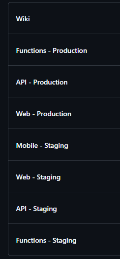
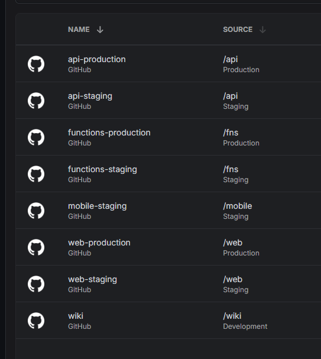

# TypeScript Monorepo Template

## Table of Contents

- [TypeScript Monorepo Template](#typescript-monorepo-template)
  - [Table of Contents](#table-of-contents)
  - [Overview](#overview)
    - [Key Features](#key-features)
  - [Structure](#structure)
    - [Apps](#apps)
    - [Services](#services)
    - [Packages](#packages)
  - [Setup \& Configuration](#setup--configuration)
    - [GitHub](#github)
    - [Infisical](#infisical)
    - [EAS](#eas)
    - [Firebase](#firebase)
  - [Getting Started](#getting-started)
    - [1. Install Dependencies](#1-install-dependencies)
    - [2. Run Development Scripts](#2-run-development-scripts)
    - [3. Access Local Services](#3-access-local-services)
  - [Documentation](#documentation)
  - [Future Work](#future-work)

---

## Overview

This is a modern TypeScript monorepo template designed for building scalable applications with shared packages and services. It provides a robust foundation for developing multi-platform applications with consistent tooling, shared libraries, and efficient development workflows.

The template is built using industry-standard tools and follows best practices for monorepo management, making it easy to scale from small projects to enterprise-level applications.

### Key Features

1. **Multi-Platform Applications**:
   - **Mobile**: React Native/Expo app template for iOS and Android development
   - **Web**: Next.js application with modern React features and TypeScript support
   - **Documentation**: Docusaurus-based documentation site for project documentation

2. **Backend Services**:
   - **API**: Hono-based API service optimised for serverless deployment
   - **Functions**: Cloud function templates for background processing and event handling

3. **Shared Packages**:
   - **Common**: Utilities and types shared across all environments
   - **Core**: Business logic and server-side utilities
   - **UI**: Reusable UI components for web and mobile applications
   - **OpenAPI Schema**: Type-safe API client generation from OpenAPI specifications

4. **Developer Experience**:
   - TypeScript-first development with strict type checking
   - Unified tooling across all packages (ESLint, Prettier, Vitest)
   - Hot module replacement and fast refresh for rapid development
   - Automated testing and build processes with Turborepo

This monorepo was initialised using the
[Mono TS](https://github.com/0x80/mono-ts) template and has been customised to
provide a comprehensive foundation for TypeScript-based projects.

---

## Structure

The monorepo is organised into the following key components:

### Apps

- **Web**: A Next.js application template featuring:
  - Server-side rendering and static site generation
  - TypeScript configuration with strict type checking
  - Modern React patterns and hooks
  - Responsive design system integration
- **Mobile**: An Expo/React Native application template providing:
  - Cross-platform mobile development for iOS and Android
  - Shared codebase with platform-specific optimisations
  - Native module integration capabilities
- **Wiki**: A Docusaurus-based documentation site template for:
  - Project documentation and API references
  - Developer guides and tutorials
  - Collaborative documentation workflows

### Services

- **API**: A **Hono-based API service** optimised for serverless environments. Provides:
  - Type-safe API development with OpenAPI schema generation
  - Middleware for authentication, validation, and error handling
  - Integration patterns for databases and external services

- **FNS**: Cloud function templates for background processing, including:
  - Event-driven architecture patterns
  - Scheduled job processing
  - Integration with cloud services and databases

### Packages

- **Common**: Shared utilities and types used across all applications and services
- **Core**: Business logic and server-side utilities for backend services
- **UI**: Reusable UI component library for web and mobile applications
- **Openapi-Schema**: Automated TypeScript type generation from OpenAPI specifications

---

## Setup & Configuration

>[!IMPORTANT]
Please note that future work includes setting up scripts to automate the following manual steps. Automation improvements are welcomed.

### GitHub

1. Create new repo selecting `ts-monorepo` as the template

2. Create Repository level GitHub Environments

    

3. Modify the Delvi Assistant GitHub App so it can be used in your new repo

4. Modify Organisation Secrets so it can be acccessed by your new repo's github actions

### Infisical

1. Create a new infisical project with the following folder sturcture

    

2. Link project with infisical by running `infisical init` in the root directory

3. Create an Infisical App Connection with your new GitHub Repo

4. Create Infisical Integrations with Github Repo Environments (automatically syncs secret values whenever they are modified in Infisical)

    

### EAS

1. Create app identifers for dev, staging and prod in Apple Developer

2. Set the base bundle id in [app.config.ts](./apps/mobile/app.config.ts)

3. Setup Apps in Google Play and App Store Connect

4. Create new Expo project

5. Configure EAS credentials for ios and android build variants (staging + prod) by running `eas credentials` and following the prompts

6. Configure EAS credentials for ios and android submissions

> [!WARNING]
> Ensure that envs are updated in [eas.json](./apps/mobile/eas.json) AND added to Expo, to ensure that expo updates will contain the required environment variables

### Firebase

1. Create separate Firebase projects for each dev, staging & prod

2. Enable Blaze plan for each

3. Add android & ios apps to each respective projects

4. Update project identifers to `./firebaserc` in `./`, `./apps/wiki`, `./apps/web`

5. Add server identifiers to [env.ts](./packages/core/src/env.ts)

    ```ts
    // env.ts
    export const ServerIdentifier = {
      Development: 'TODO: get dev env id',
      Staging: 'TODO: get staging env id',
      Production: 'TODO: get prod env id',
    } as const;
    ```

6. After deploying api, update the url listed in [gen-schema.sh](./packages/openapi-schema/gen-schema.sh) and then run the script to ensure it works

---

## Getting Started

To set up the project locally, follow these steps:

### 1. Install Dependencies

This project uses PNPM for package management. If you don’t have PNPM installed,
you can set it up using Corepack:

```bash
corepack enable
corepack prepare pnpm@latest-10 --activate
pnpm install
```

### 2. Run Development Scripts

Use the following scripts to start development:

- `pnpm watch`: Continuously builds all packages using Turborepo.
- `pnpm dev`: Starts the web app development server.
- `pnpm emulate`: Starts the Firebase emulators for local testing.

### 3. Access Local Services

- Web app: [http://localhost:3000](http://localhost:3000)
- API documentation: Check your API service configuration
- Development tools: Refer to individual package documentation

---

## Documentation

For detailed information about this monorepo template, refer to the individual package README files and documentation within each service and application directory.

Key documentation locations:

- `apps/web/README.md` - Web application setup and development
- `apps/mobile/README.md` - Mobile application development guide  
- `services/api/README.md` - API service documentation
- Package-specific README files in the `packages/` directory

## Future Work

- Adding .env.templates to each workspace for existing environment variables
- Resolve TypeScript check issues for the api workspace when run in CI. See [build-api workflow](.github/workflows/build-api.yml)
- Firebase project setup script
- Infisical project setup script
- GitHub Environment setup script
- Infisical & GitHub Integration setup script
- Add production deployment workflows

This template provides a foundation for building modern TypeScript applications. Customise the structure, tooling, and documentation to fit your specific project needs.
