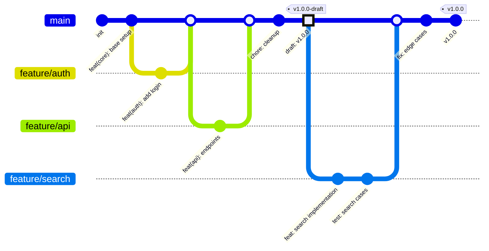

# Branching Strategy

:::info
This guide outlines our branching strategy, which follows
[trunk-based development](https://trunkbaseddevelopment.com/). The main branch
serves as the trunk and doubles as our staging environment. Every change is tied
to a work item in YouTrack and follows specific guidelines to maintain
consistency and quality.
:::

---



## Key Principles

### 1. Branching Strategy

:::important

- All branches must:
  - Be **taken off the `main` branch**.
  - Be **merged back into the `main` branch** upon completion.
- Each branch corresponds to a single work item in YouTrack.
- The branch name **must match the task name** in YouTrack.

  :::

:::tip
Keeping branches tied to specific work items ensures traceability and
simplifies code reviews.
:::

### 2. Commit Practices

:::note

- Use **atomic commits**, where each commit represents a single, meaningful change.
- Follow **conventional commit** practices for commit messages:
  - Format: `<type>(<scope>): <description>`
  - Example: `feat(mobile): add dark mode toggle`
- Avoid mixing unrelated changes in a single commit.
- See [CONTIRBUTING](https://github.com/delvdotcom/ts-monorepo/blob/main/CONTRIBUTING.md) for valid type and scope values

  :::

:::tip
Atomic commits improve readability and make it easier to identify the cause of
issues during debugging.
:::

---

## Workflow

### Step 1: Create a Branch

:::info

- Check out the `main` branch and ensure it is up-to-date:

  ```bash
  git checkout main
  git pull origin main
  ```

- Create a new branch based on the YouTrack task name:

  ```bash
  git checkout -b <task-name>
  ```

  Example:

  ```bash
  git checkout -b feature/add-user-authentication
  ```

  :::

### Step 2: Develop Your Feature

:::note

- Make changes locally and commit frequently using atomic commits.
- Example commit messages:

  ```bash
  git commit -m "feat(auth): implement login API"
  git commit -m "fix(auth): handle invalid credentials"
  ```

  :::

### Step 3: Test Changes

:::caution

- Run all relevant tests locally before pushing the branch.
- For UI changes, use **Storybook** and **React-Native-Design-Mode** to
  validate manually/visually.

  :::

### Step 4: Push the Branch

:::note
Push your branch to the remote repository:

```bash
git push origin <branch-name>
```

:::

### Step 5: Open a Pull Request (PR)

:::important

- Open a PR targeting the `main` branch.
- Ensure the PR description includes:
  - A link to the related YouTrack task.
  - A summary of the changes made.
    :::

:::warning
Always request a peer review to ensure code quality and adherence to guidelines.
:::

### Step 6: Squash Merge

:::info

- Once approved, **squash merge** the branch into `main` to maintain a clean
  commit history.
- Example workflow:
  - Click "Squash and Merge" in the PR interface.
  - Edit the commit message to summarize the feature or fix.
    :::

:::tip
Squash merging condenses all commits in a branch into a single commit, making
the history easier to navigate.
:::

### Step 7: Delete the Branch

:::note
After merging, delete the branch to keep the repository tidy.
:::

## Handling Merge Conflicts

:::warning
Merge conflicts occur when Git cannot automatically merge changes. They require
manual resolution to ensure code integrity.
:::

### When Conflicts Occur

:::info
Merge conflicts typically happen when:

- Multiple developers modify the same file sections
- Changes in main branch conflict with your feature branch
- Long-lived branches diverge significantly from main

  :::

### Resolving Conflicts

:::important

1. First, ensure your branch is up to date with main:

   ```bash
   git checkout main
   git pull origin main
   git checkout your-branch
   git merge main
   ```

2. When conflicts appear, use your IDE's merge conflict resolution tools or
   resolve manually:

   ```bash
   # Files with conflicts will be marked with conflict markers
   <<<<<<< HEAD
   your changes
   =======
   main branch changes
   >>>>>>> main
   ```

3. After resolving each file:

   ```bash
   git add <resolved-file>
   ```

4. Complete the merge:

   ```bash
   git commit -m "resolve merge conflicts with main"
   ```

:::

### Best Practices

:::tip

- Regularly sync your branch with main to minimize conflicts
- Resolve conflicts in small chunks to maintain clarity
- Consult with team members when unsure about conflicting changes
- Test thoroughly after resolving conflicts

  :::

:::caution
Always ensure the application builds and tests pass after resolving conflicts.
Incorrect conflict resolution can introduce bugs.
:::

---

## Summary Checklist

:::important

### For Branch Creation

- [ ] Branch name matches the YouTrack task name.
- [ ] Branch is based on `main`.

### During Development

- [ ] Follow atomic commit principles.
- [ ] Use conventional commit messages.
- [ ] Test all changes locally.

### For Merging

- [ ] Link the PR to the YouTrack task.
- [ ] Peer review is completed.
- [ ] Use squash merge to merge into `main`.
- [ ] Delete the branch after merging.
      :::

:::success
Adhering to this guide ensures a consistent and maintainable branching process
that aligns with trunk-based development principles.
:::
