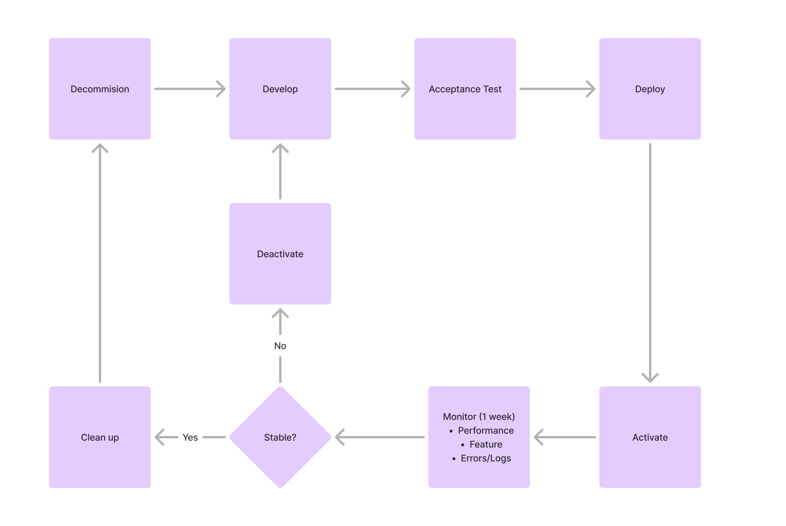

# Feature Flags

Feature flags enable us to modify system behavior without changing or redeploying code. We use Firebase Remote Config to manage feature flags across all projects.

## Types

We support three types of feature flags, each serving a specific purpose:

| Type         | Expiration | Purpose                                                                                     |
|--------------|------------|---------------------------------------------------------------------------------------------|
| release      | 10 days    | Control the short-term rollout of new features in production                                |
| experimental | 5 days     | A/B testing and validating experimental features                                            |
| kill_switch  | permanent  | Optional, implemented for critical features that we wish to maintain long-term control over |

:::note

Generally, any given user story will have:

- 1 release feature flag
- 0 or many experimental flags
- 0 or many kill switch flags

These are to be identified during task planning.

:::

## Naming Convention

Feature flags follow a strict naming pattern to ensure consistency and traceability:

```txt
<type>__<story>__<flagname>

Examples: 
  release__NDEV_2283__language_localisation_for_mobile
  release__NDEV_2605__business_loyalty_management
  experimental__NDEV_2283__new_onboarding_flow
  kill_switch__NDEV_2605__loyalty_points_calculation
```

## Lifecyle

For short-term feature flags (release and experimental) the following lifecycle is followed:



## Additional Resources

[Remote Config](https://firebase.google.com/docs/remote-config)

[FlagSmith](https://docs.flagsmith.com/guides-and-examples/flag-lifecycle)
